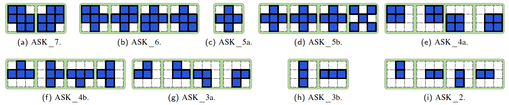

# ASKs: Convolution with any-shape kernels for efficient neural networks
## Introduction
This is the PyTorch implementation and CUDA program of our paper "[ASKs: Convolution with any-shape kernels for efficient neural networks](https://www.sciencedirect.com/science/article/pii/S0925231221004070)".

## Requirements
Python 3.6.0  
Pytorch 1.8.0  
Torchvision 0.9.0  
NVIDIA CUDA Toolkit 11.2

## Baseline
Train and test the baseline model (VGG or ResNet) on CIFAR-10/100.
* VGG  
Optional depth: VGG11 / 13 / 16 / 19
```shell
python main.py --arch vgg --depth 16 --save ./logs/vgg16
```
* ResNet  
Optional depth: 6n+2, such as ResNet20  / 32 / 56
```shell
python main.py --arch resnet --depth 20 --save ./logs/resnet20
```
## ASKs
There are several kernel shapes to choose from: ASK_7, ASK_6, ASK_5a, ASK_5b, ASK_4a, ASK_4b, ASK_3a, ASK_3b, ASK_2.


* VGG
```shell
python main.py --arch vgg_any --depth 16 --anycfg ASK_5a --save ./logs/vgg16-ASK_5a
```
* ResNet
```shell
python main.py --arch resnet_any --depth 20 --anycfg ASK_5a --save ./logs/resnet20-ASK_5a
```

## CUDA  
The models obtained above are completely implemented in PyTorch, which save parameters and FLOPs but run slightly slower than the baseline model.
We can accelerate ASKs by designing CUDA program.
1. Setup the module
```shell
python setup.py install
```
2. Evaluate inference latency
* Baseline
```shell
python evaluateTime.py --arch vgg --depth 16
python evaluateTime.py --arch resnet --depth 20
```
* ASKs
```shell
python evaluateTime.py --arch vgg_cuda_any --depth 16 --anycfg ASK_5a
python evaluateTime.py --arch resnet_cuda_any --depth 20 --anycfg ASK_5a
```
3. Validate the accuracy  
Validate the accuracy of the accelerated model by copying the weights from the unaccelerated model.
```shell
python validate.py --arch vgg_any --depth 16 --anycfg ASK_5a --resume ./logs/vgg16-ASK_5a/model_best.pth.tar
python validate.py --arch resnet_any --depth 20 --anycfg ASK_5a --resume ./logs/resnet20-ASK_5a/model_best.pth.tar
```

## A summary of results

* Results of VGG-16 on CIFAR-10:

|  Network  | Kernel | Params. (M) | FLOPs (M) | Latency (ms) | Accuracy |
|  :----:   | :----: |    :----:   |  :----:   |   :----:     |  :----:  |
|  VGG-16   |  3x3   |     15.0    |    314    |    2.244     |  93.53%  |
|  VGG-16   | ASK_7  |     11.7    |    245    |    1.667     |  94.07%  |
|  VGG-16   | ASK_6  |     10.1    |    210    |    1.667     |**94.13%**|
|  VGG-16   | ASK_5a |     8.45    |    175    |    1.664     |  94.04%  |
|  VGG-16   | ASK_5b |     8.45    |    175    |    1.660     |  93.90%  |
|  VGG-16   | ASK_4a |     6.82    |    140    |    1.653     |  93.94%  |
|  VGG-16   | ASK_4b |     6.82    |    140    |    1.657     |  93.92%  |
|  VGG-16   | ASK_3a |     5.18    |    106    |    1.654     |  93.89%  |
|  VGG-16   | ASK_3b |     5.18    |    106    |    1.652     |  93.68%  |
|  VGG-16   | ASK_2  |   **3.55**  |  **70.8** |  **1.645**   |  93.28%  |

* Results of ResNet-20 on CIFAR-10:

|  Network  | Kernel | Params. (M) | FLOPs (M) | Latency (ms) | Accuracy |
|  :----:   | :----: |    :----:   |  :----:   |   :----:     |  :----:  |
| ResNet-20 |  3x3   |     0.27    |    41.1   |    2.773     |  92.05%  |
| ResNet-20 | ASK_7  |     0.21    |    32.1   |    2.336     |**91.94%**|
| ResNet-20 | ASK_6  |     0.18    |    27.6   |    2.331     |  91.65% |
| ResNet-20 | ASK_5a |     0.15    |    23.1   |    2.330     |  91.44%  |
| ResNet-20 | ASK_5b |     0.15    |    23.1   |    2.330     |  91.78%  |
| ResNet-20 | ASK_4a |     0.12    |    18.6   |    2.327     |  90.79%  |
| ResNet-20 | ASK_4b |     0.12    |    18.6   |    2.329     |  91.12%  |
| ResNet-20 | ASK_3a |     0.09    |    14.1   |    2.328     |  89.95%  |
| ResNet-20 | ASK_3b |     0.09    |    14.1   |    2.325     |  90.26%  |
| ResNet-20 | ASK_2  |   **0.06**  |  **9.58** |  **2.323**   |  88.60%  |

* Results of ResNet-32 on CIFAR-10:

|  Network  | Kernel | Params. (M) | FLOPs (M) | Latency (ms) | Accuracy |
|  :----:   | :----: |    :----:   |  :----:   |   :----:     |  :----:  |
| ResNet-32 |  3x3   |     0.46    |    69.8   |    4.096     |  92.82%  |
| ResNet-32 | ASK_7  |     0.36    |    54.5   |    3.419     |**92.36%**|
| ResNet-32 | ASK_6  |     0.31    |    46.8   |    3.417     |  92.25%  |
| ResNet-32 | ASK_5a |     0.26    |    39.2   |    3.414     |  91.83%  |
| ResNet-32 | ASK_5b |     0.26    |    39.2   |    3.414     |  92.19%  |
| ResNet-32 | ASK_4a |     0.21    |    31.5   |    3.412     |  91.72%  |
| ResNet-32 | ASK_4b |     0.21    |    31.5   |    3.409     |  91.94%  |
| ResNet-32 | ASK_3a |     0.16    |    23.9   |    3.406     |  90.54%  |
| ResNet-32 | ASK_3b |     0.16    |    23.9   |    3.403     |  90.57%  |
| ResNet-32 | ASK_2  |   **0.11**  |  **16.2** |  **3.385**   |  89.01%  |

* Results of ResNet-56 on CIFAR-10:

|  Network  | Kernel | Params. (M) | FLOPs (M) | Latency (ms) | Accuracy |
|  :----:   | :----: |    :----:   |  :----:   |   :----:     |  :----:  |
| ResNet-56 |  3x3   |     0.85    |    127    |    6.614     |  93.16%  |
| ResNet-56 | ASK_7  |     0.66    |    99.2   |    5.639     |**93.59%**|
| ResNet-56 | ASK_6  |     0.57    |    85.3   |    5.620     |  93.12%  |
| ResNet-56 | ASK_5a |     0.48    |    71.3   |    5.616     |  92.86%  |
| ResNet-56 | ASK_5b |     0.48    |    71.3   |    5.618     |  93.02%  |
| ResNet-56 | ASK_4a |     0.38    |    57.4   |    5.605     |  92.31%  |
| ResNet-56 | ASK_4b |     0.38    |    57.4   |    5.599     |  92.55%  |
| ResNet-56 | ASK_3a |     0.29    |    43.4   |    5.586     |  91.54%  |
| ResNet-56 | ASK_3b |     0.29    |    43.4   |    5.585     |  91.50%  |
| ResNet-56 | ASK_2  |   **0.19**  |  **29.5** |  **5.519**   |  90.23%  |

## Tips
* Our test environment is NVIDIA GeForce RTX 3090 GPU and PyTorch 1.9.0. Different environments may lead to slightly different results.
* We have only written the CUDA program of the forward function. If you also write the CUDA program of the backward function, both training and inference can be accelerated, and there is no need to validate the compressed model.
* You can design the shapes of convolution kernels according to your own needs or ideas, and imitate the given codes for implementation and acceleration.
* You can try different kernel shapes for different layers by changing the cfglist, for example:
```python
any_vgg16_cfglist = {
'ASK_7'  :[[[1,2,4,5,6,8,9],[2,3,4,5,6,7,8]] for i in range(13)],
'ASK_6'  :[[[1,2,4,5,6,8],[2,3,4,5,6,8],[2,4,5,6,7,8],[2,4,5,6,8,9]] for i in range(13)],
'ASK_5a' :[[[2,4,5,6,8]] for i in range(13)],
'ASK_5b' :[[[2,4,5,6,8],[2,4,5,6,8],[2,4,5,6,8],[1,3,5,7,9]] for i in range(13)],
'ASK_4a' :[[[1,2,4,5],[2,3,5,6],[4,5,7,8],[5,6,8,9]] for i in range(13)],
'ASK_4b' :[[[2,4,5,6],[2,5,6,8],[4,5,6,8],[2,4,5,8]] for i in range(13)],
'ASK_3a' :[[[2,4,5],[2,5,6],[4,5,8],[5,6,8]] for i in range(13)],
'ASK_3b' :[[[2,5,8],[4,5,6]] for i in range(13)],
'ASK_2'  :[[[2,5],[4,5],[5,6],[5,8]] for i in range(13)],
'ASK_my':[[[2,4,5,6,8]],
          [[2,4,5,6,8]],
          [[2,4,5,6,8]],
          [[2,4,5,6,8]],
          [[2,4,5,6,8]],
          [[2,4,5,6,8]],
          [[2,4,5,6,8]],
          [[2,4,5,6,8]],
          [[2,4,5,6,8]],
          [[2,4,5,6,8]],
          [[2,5],[4,5],[5,6],[5,8]],
          [[2,5],[4,5],[5,6],[5,8]],
          [[2,5],[4,5],[5,6],[5,8]]],   #The first 10 layers use ASK_5a, and the last 3 layers use ASK_2.
}
```
## Citation

If you find this work useful, please cite the following paper:

```
@article{liu2021asks,
  title={ASKs: Convolution with any-shape kernels for efficient neural networks},
  author={Liu, Guangzhe and Zhang, Ke and Lv, Meibo},
  journal={Neurocomputing},
  volume={446},
  pages={32--49},
  year={2021},
  publisher={Elsevier}
}
```